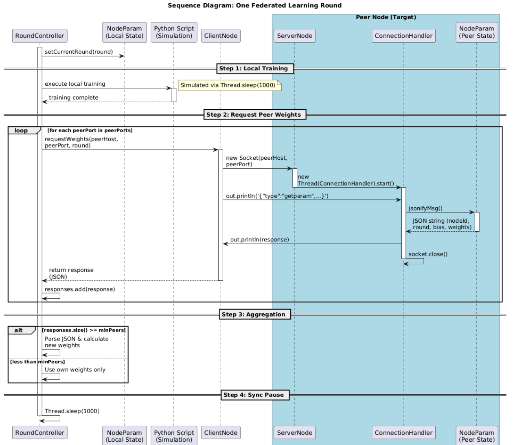
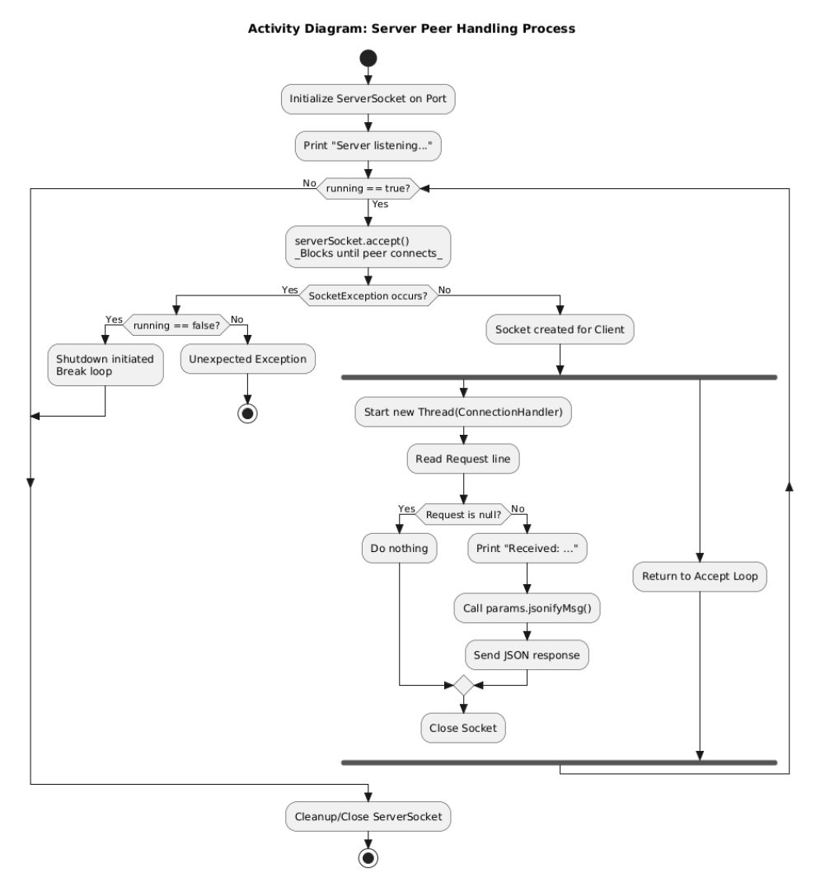
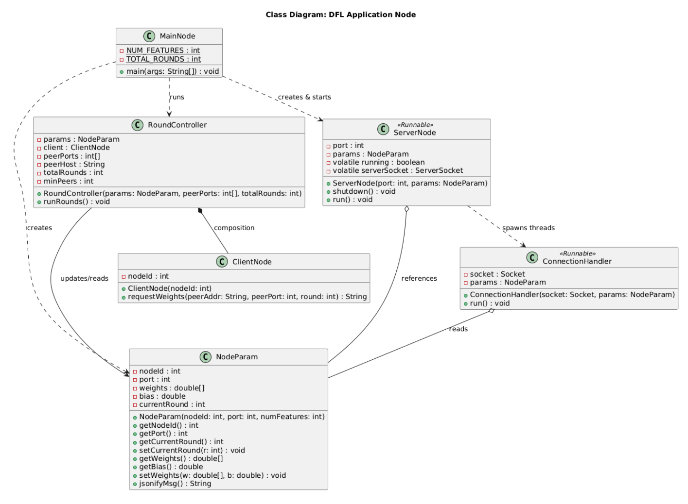

# Distributed Federated Learning (DFL) - Java Prototype

This project is a Java-based Decentralized Federated Learning (DFL) prototype. It simulates a distributed hospital setup where each node conducts local model training and performs peer-to-peer parameter exchange (weights and biases) using raw TCP sockets and JSON.

Unlike centralized federated learning, there is no central aggregation server. Every node acts as both a learner and an aggregator by directly requesting peer parameters and computing its own average locally.

## Prerequisites

- **Java 17** or higher
- **Maven** (for building and executing the project)

## How to Build and Run

1. **Compile the project**:
   ```bash
   mvn clean compile
   ```

2. **Run the Nodes (Simulated Hospitals)**:
   Open three separate terminals and start one node in each. The arguments are: `<nodeId> <port> [peerPorts...]`

   **Terminal 1 (Node 1):**
   ```bash
   mvn exec:java -Dexec.mainClass="hospital.dfl.MainNode" -Dexec.args="1 8001 8002 8003"
   ```

   **Terminal 2 (Node 2):**
   ```bash
   mvn exec:java -Dexec.mainClass="hospital.dfl.MainNode" -Dexec.args="2 8002 8001 8003"
   ```

   **Terminal 3 (Node 3):**
   ```bash
   mvn exec:java -Dexec.mainClass="hospital.dfl.MainNode" -Dexec.args="3 8003 8001 8002"
   ```

---

## Architecture & Workflows

### 1. One Federated Learning Round (Sequence Diagram)

Each training round follows a specific sequence. A node simulates local training, requests parameters sequentially from its peers, aggregates the responses, and then pauses before the next round.

**Steps:**
1. **Local Training**: The node trains on its local data (currently a simulated pause).
2. **Request Peer Weights**: The node connects to known peers via TCP to request their locally trained weights in JSON format.
3. **Aggregation**: If enough peers respond, the local node parses the JSON and averages the weights.
4. **Sync Pause**: A short delay syncs the nodes loosely between rounds.



### 2. Server Peer Handling Process (Activity Diagram)

To prevent the main application loop from blocking, the server logic runs in a separate thread. When peer requests come in, they are immediately offloaded to a newly spawned `ConnectionHandler` thread. This guarantees nodes can respond to multiple peers simultaneously without becoming deadlocked.



### 3. Application Structure (Class Diagram)

The codebase revolves around a centralized state object (`NodeParam`). By utilizing `synchronized` accessors within `NodeParam`, the client sequence and the asynchronous server handler can read and update the node's machine learning weights safely without race conditions.



## Open Problems & Development Roadmap

The current prototype establishes the peer-to-peer networking skeleton. The following four problems are the next development targets, listed in recommended implementation order.

***

### Problem 1 — Python ML Integration

**Current state:** Local training is a placeholder `Thread.sleep()` inside `RoundController`. No real model exists yet.

**Problem:** The ML team is writing the model in Python. Java and Python are separate processes and cannot share memory directly. A bridge is needed so Java can trigger training and receive updated weights back.

**Planned solution — localhost socket bridge:**

Python will run as a persistent client that connects to a local Java bridge server on the same machine. Java owns the round lifecycle and drives the conversation. Python only responds.

```
EACH NODE (one machine):

Python process                    Java process
     │                                 │
     │── connects to localhost:9000 ──►│  (Java bridge server, port 9000)
     │── sends: {weights, bias} ───────►│
     │                                 │── peer exchange with other nodes
     │                                 │── aggregates received peer weights
     │◄── receives: {aggregated} ──────│
     │── trains locally on aggregated  │
     │── sends: {new weights, bias} ──►│
     │◄── {"status":"ok"} ────────────│
     │   (next round begins)           │
```

Each Java node therefore runs **two servers**:
- **Peer server** (e.g. port 8001): handles weight exchange with other hospital nodes.
- **Python bridge server** (e.g. port 9000): handles communication with the local Python process only.

Java is responsible for the federated averaging calculation. Python is responsible for local model training only. Raw patient data never leaves the Python process.

**Classes to add:**
- `PythonBridgeServer` — local TCP server that Python connects to.
- `PythonBridgeHandler` — handles one Python training cycle per round.

***

### Problem 2 — Python ↔ Java Synchronization

**Current state:** No synchronization mechanism exists between the Python and Java processes on the same node.

**Problem:** Both sides could end up waiting on each other simultaneously — Java waiting for Python to finish training while Python is waiting for Java to send aggregated weights. This is a classic deadlock scenario.

**Planned solution — strict turn-based protocol with timeouts:**

The protocol is always one direction at a time. Java drives the sequence; Python only responds and never initiates mid-round:

```
Round r:
  1. Java sends aggregated weights to Python  →  Python receives
  2. Python trains locally                    →  Java waits (with timeout)
  3. Python sends updated weights to Java     →  Java receives
  4. Java updates NodeParam, starts round r+1
```

Rules:
- Java applies a **training timeout** (e.g. 10 seconds) on the bridge socket. If Python does not reply in time, Java skips the Python update that round and uses the last known weights.
- Python applies a **receive timeout** when waiting for aggregated weights from Java. If Java does not send within the timeout, Python resends its previous weights unchanged.
- Neither side ever waits on the other indefinitely — timeouts are the exit condition on both ends.

This prevents deadlock without requiring semaphores or shared memory, because Java and Python never both wait at the same moment.

***

### Problem 3 — Startup Handshake & Peer Discovery

**Current state:** `waitForPeers()` in `MainNode` does a raw TCP probe — it opens a connection and immediately closes it to check if the peer port is bound. It does not confirm the peer is fully ready.

**Problem:** Nodes may start at different times. A raw probe only confirms the port is open, not that the peer has finished initializing its state. Rounds should not begin until all reachable peers have confirmed readiness.

**Planned solution — HELLO/ACK handshake on startup:**

Replace the raw probe with a proper handshake message exchange:

```
Node A → {"type":"HELLO","nodeId":1,"port":8001}
Node B ← {"type":"ACK","nodeId":2}
```

Each node retries the handshake up to N times (e.g. 3) with a configurable delay between attempts (e.g. 2 seconds). Once a peer ACKs, it is marked as **online**. After all handshake attempts complete — whether successful or not — the node proceeds to rounds.

Peers that never ACK are marked **offline** and skipped during rounds, but they are not a blocking condition. The system continues without them and reattempts on future rounds via the existing timeout logic.

**Classes to add or modify:**
- `HandshakeManager` — handles the retry loop and tracks peer status.
- `NodeParam` — add a `Set<Integer> onlinePeers` field to track which peers responded.
- `RoundController` — only contact peers that are in `onlinePeers`, skip the rest.

***

### Problem 4 — Round Timing & Loose Synchronization

**Current state:** The round controller uses a fixed `Thread.sleep(1000)` pause between rounds. There is no mechanism to keep nodes on roughly the same round.

**Problem:** Nodes train at different speeds. A fast node finishes round 3 while a slow node is still on round 2. If the fast node asks the slow node for round 3 weights, the slow node only has round 2 weights. Strict round-matching would cause them to permanently diverge and never exchange weights again.

**Planned solution — fixed round timer window (soft barrier):**

Each round has a fixed duration (e.g. 8 seconds). Every node starts its timer at the beginning of the round. Within that window, the node trains locally, requests peer weights, and aggregates whatever arrives. When the timer expires, the round ends regardless of how many peers responded.

```
Round r opens → timer starts (8 seconds)
  ├── Node trains locally (however long it takes)
  ├── Node sends GET_WEIGHTS to peers
  ├── Collects responses that arrive before timer expires
  ├── Aggregates whatever was received (minimum 1 peer, else own weights)
Round r closes when timer expires → move to round r+1
```

This is called a **soft barrier**: nodes that finish early wait for the timer. Nodes that are slow get cut off and proceed with partial results. The timer acts as a shared clock that keeps nodes loosely synchronized without any central coordinator.

Round number matching rule:
- **Accept** peer responses where `peer.round >= myRound` (same round or ahead).
- **Reject** peer responses where `peer.round < myRound` (stale, from a previous round).
- A peer that is behind will naturally catch up over subsequent rounds once the faster node responds to its later requests.

**Configuration values to add to `Config` or `MainNode`:**
```java
static final int ROUND_DURATION_MS  = 8000;  // total time per round
static final int PEER_TIMEOUT_MS    = 3000;  // per-peer socket timeout
static final int MIN_PEERS_REQUIRED = 1;     // minimum peers to aggregate
```

***

## Development Priority Order

| Priority | Problem | Effort | Impact |
|---|---|---|---|
| 1 | Startup handshake (Problem 3) | Low | Prevents early-round failures |
| 2 | Round timer window (Problem 4) | Low-Medium | Keeps nodes in sync |
| 3 | Python integration (Problem 1) | Medium | Enables real ML training |
| 4 | Python ↔ Java sync (Problem 2) | Medium | Makes Python integration stable |

Problems 3 and 4 are pure Java and can be implemented now. Problems 1 and 2 require coordination between the networking and ML subteams and should be tackled together once the Java skeleton is stable.